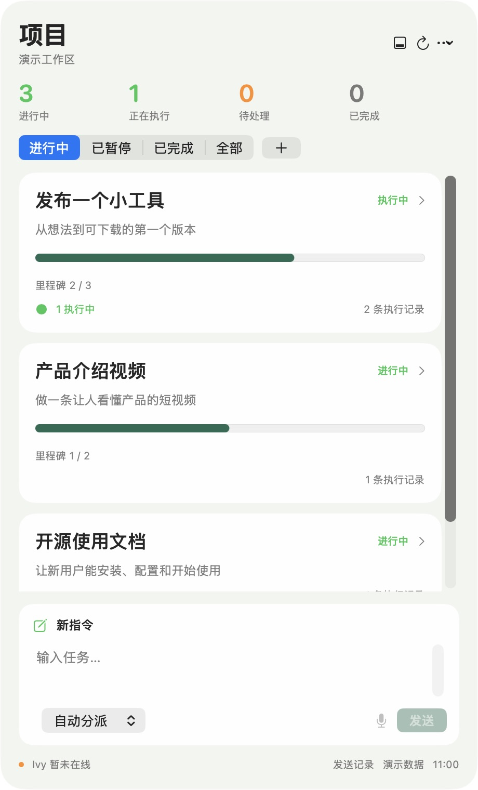
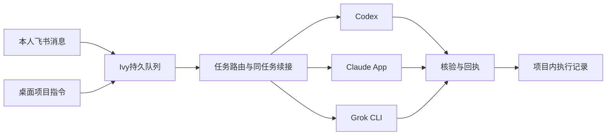

# Ivy

macOS 上的个人 Agent 项目与目标面板：从飞书或桌面发指令，按项目查看目标、里程碑、执行状态与回执，按原任务续接 Codex、Claude App 或 Grok CLI。

这是个人工作台的首个公开开发版。代码与可选的 [Ivy 人格卡](persona/SOUL.md) 采用 MIT 许可。它不是任何模型厂商的官方产品，没有宣称已达成官方合作。

## 已有能力

- AppKit 无标题栏桌面组件，默认贴桌面底层，可临时浮起；任务列表优先，输入区置底。
- 首页按项目聚合，进入项目后才显示执行会话；未归类记录集中收纳，不占据首页。
- 每个项目有独立目标、里程碑和追踪状态。聊天结束不等于项目完成，完成度只计算明确勾选的里程碑。
- 新建/编辑项目、添加/勾选里程碑、会话重新归类都只改本地数据，不调用模型。
- Codex / Claude 原会话名称；Grok 任务渠道标识；历史记录和发送回执。
- 自动、Codex、Claude、Grok CLI 四种发送选项。按稳定任务 ID 续接，提交编号去重。在桌面项目中发送指令时附带项目ID、目标和关联记录；飞书入口保留原有任务路由。
- 麦克风按钮，通过 macOS Speech + AVFoundation 把语音写入可编辑草稿；不自动发送。优先本机识别，不支持时使用 Apple 在线识别，界面明确显示。
- 飞书长连接与轮询补收、SQLite 持久队列、独立任务会话、结果回读。
- 界面每 15 秒由脚本刷新，没有模型定时空转。



## 工作流



项目是管理层，任务/会话是执行层，里程碑是验收层。将会话归入同一项目不会合并模型上下文，也不会执行旧任务。项目暂停或完成只修改追踪状态，不操作后台服务；同项目多个未完成任务也不会因为项目卡片可见而被唤醒。

首次使用没有你的私有项目数据，需要点“＋”新建项目，并从“待归类”的记录菜单归入项目。不靠模糊标题在后台自动改归属。作者本机的初始归类没有进入公开仓库。

## 运行条件与边界

需要 macOS 14+、Xcode Command Line Tools、Python 3.9+，以及你自己的飞书机器人和模型账号。模型名称对应作者当前环境，不保证所有账号都可用。

默认执行渠道是 Codex `gpt-6-astra / high`；`[OK]` 使用 Claude App `Opus 5.5 / High`；`[看]` 使用 Grok CLI `grok-4.6 / xhigh`。后两者由 Codex 宿主按渠道规则交接。Claude 路径需要宿主提供可控制已登录 Claude App 的电脑工具，不是跨平台 Claude API 适配器；缺少该能力应返回 blocked，不能改用 CLI 冒充。Grok 需要已安装并登录的 `~/.grok/bin/grok`。

Codex / Claude 本地会话读取依赖当前桌面产品的数据格式，产品升级可能需要维护。当前只读本机，没有其他设备自动同步。首次公开版未在全新 Mac 上安装验收，也没有签名、公证或 App Store 发布。

这不是 WidgetKit 扩展。Apple 标准小组件不支持这里需要的滚动列表和直接文本输入。参考 [Apple WidgetKit](https://developer.apple.com/documentation/widgetkit/creating-a-widget-extension)。

## 本地运行

```sh
python3 -m venv .venv
source .venv/bin/activate
python3 -m pip install -r requirements.txt
cp .env.example .env
```

用编辑器填写 `.env` 的三个飞书字段，不把文件提交到 Git。飞书应用需启用相应机器人、消息读取与发送权限；在独立的机器人会话中先发送一条消息，初始化只接受能唯一识别的一个人类发送者，不导入初始化前历史。

```sh
python3 80_操盘手/工具/Ivy指令入口/ivy_inbox.py init
python3 80_操盘手/工具/Ivy指令入口/ivy_service.py
```

另开终端、激活同一虚拟环境，运行长连接接收器（服务仍有轮询补收）：

```sh
python3 80_操盘手/工具/Ivy指令入口/ivy_realtime.py
```

Codex CLI 默认读取本机 ChatGPT.app 所带 app-server；路径不同可设置 `IVY_CODEX_CLI`。`.env` 位置可通过 `IVY_ENV_FILE` 更改。这些环境变量需传给启动宿主的终端进程。

构建桌面组件（不会安装登录项或启动任何服务）：

```sh
python3 80_操盘手/工具/桌面任务板/sync.py
python3 80_操盘手/工具/桌面任务板/build.py
open ~/Applications/我的任务.app
```

构建器把此仓库的真实路径写入 App 的 Info.plist；移动仓库后重新构建。只构建和打开组件时，Ivy 宿主未运行会显示离线，输入仍保存等待，不会启动停用服务。麦克风与语音识别权限在第一次点击时请求；语音最长 60 秒，可随时停止。权限由用户在系统设置管理。

## 安全演示

使用随仓库提供的合成示例，单独构建演示应用，不读真实任务，不发送指令：

```sh
python3 80_操盘手/工具/桌面任务板/build.py --output /tmp/Ivy演示.app --demo-data 80_操盘手/工具/桌面任务板/demo
open /tmp/Ivy演示.app
```

演示模式禁用发送、保存修改和麦克风。`demo/board.json` 是虚构数据，可用于截图，不代表真实项目进展。

## 测试

```sh
python3 -m unittest discover -s 80_操盘手/工具/桌面任务板 -p 'test_*.py'
python3 -m unittest discover -s 80_操盘手/工具/Ivy指令入口 -p 'test_*.py'
```

项目版公开代码：面板 24 项、宿主 41 项测试通过，Swift 编译通过。Grok 真实无工具探测返回 `grok-4.6-build`、`xhigh`；回执包含实际模型，测试不会拿配置值当实际调用结果。语音按钮和失败提示已在作者机器操作，真人麦克风准确率及全新设备权限流程尚未验收。

## 数据与人格

公开仓库不包含 `.env`、授权文件、任务数据库、原始会话、私人截图、个人画像或 Git 旧历史。数据目录见 [SECURITY.md](SECURITY.md)。

`persona/SOUL.md` 是作者明确授权公开的虚构角色设定，已删除用户档案，可独立使用或修改。角色的“搭档／伴侣”等表达不代表真实的人际关系，不改变工具权限或执行边界。这里不附带 Live2D 模型、第三方角色素材或声音克隆资产。

欢迎通过代码、问题反馈与可复现的使用案例参与。希望先形成真实使用和用户反馈，再探索与模型厂商的官方接口合作；当前没有合作承诺或对外代表授权。

实现与核验：Codex gpt-6-astra / high。Grok 探测：grok-4.6-build / xhigh。人格设定为作者既有文本的去用户资料版本。
